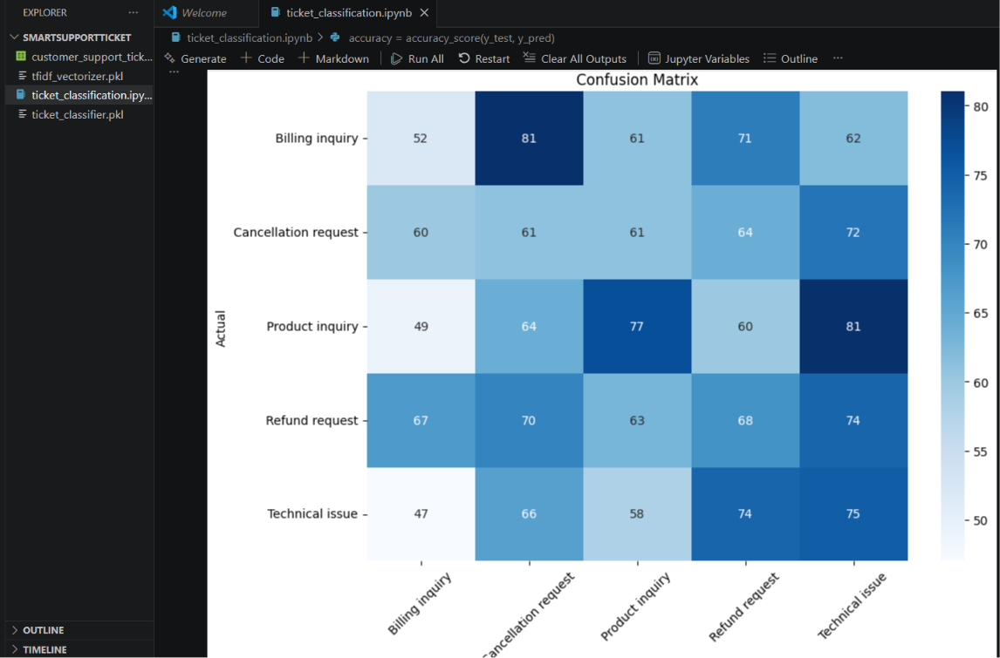
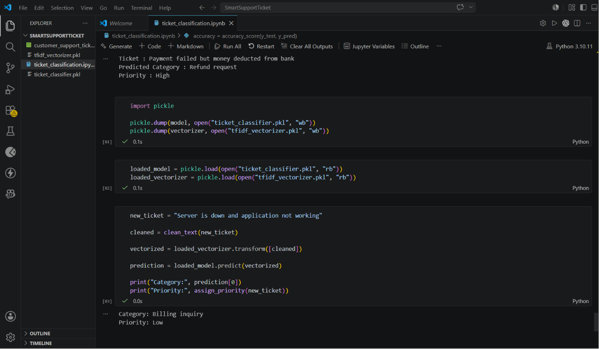

# Smart Support Ticket Classification System

## Project Overview

This project is an NLP and Machine Learning based Support Ticket Classification System that automatically categorizes customer support tickets and assigns priority levels.

The system helps businesses reduce manual work, improve response times, and manage customer issues more efficiently.

## Features

* Text preprocessing and cleaning
* Stopword removal
* TF-IDF vectorization
* Ticket category classification
* Priority prediction (High / Medium / Low)
* Confusion matrix visualization
* Model saving and loading using Pickle

## Technologies Used

* Python
* Scikit-learn
* NLTK
* Pandas
* NumPy
* Matplotlib
* Seaborn
* Jupyter Notebook

## Project Structure

```plaintext
SmartSupportTicket/
│
├── screenshots/
│   ├── confusion_matrix.png
│   └── final_output.png
│
├── customer_support_tickets.csv
├── ticket_classification.ipynb
├── ticket_classifier.pkl
├── tfidf_vectorizer.pkl
└── README.md
```

##  Workflow

1. Load customer support ticket dataset
2. Clean and preprocess ticket text
3. Convert text into TF-IDF features
4. Train machine learning model
5. Predict ticket categories
6. Assign priority levels
7. Evaluate model using confusion matrix

## Ticket Categories

* Billing Inquiry
* Refund Request
* Technical Issue
* Product Inquiry
* Cancellation Request

## Priority Levels

* High
* Medium
* Low


## 📷 Project Screenshots

### Confusion Matrix



### Final Prediction Output


## Sample Output

```plaintext
Ticket: Payment failed but money deducted from bank

Predicted Category: Refund request
Priority: High
```

---

## Future Improvements

* Streamlit Web App
* Deep Learning Models
* Real-time Ticket Prediction
* Dashboard Analytics
* Email Integration

##  Conclusion

This project demonstrates the practical use of NLP and Machine Learning for automating customer support operations and improving business efficiency.
